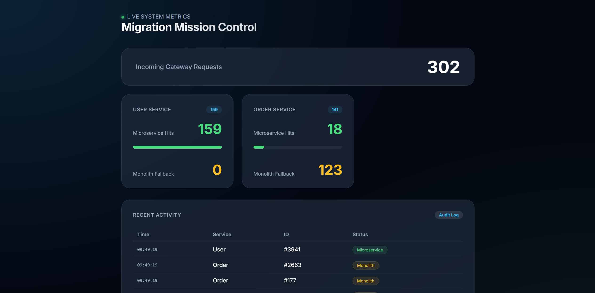
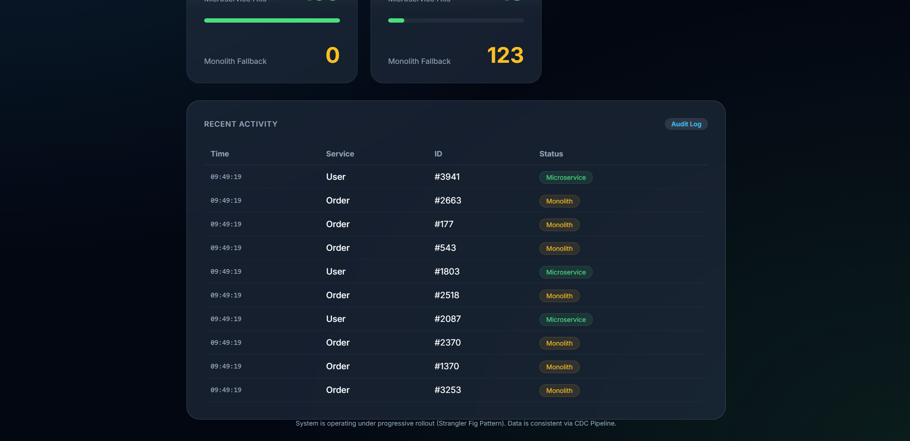

# Phase 7: Migration Observability & Data Parity

## Objective
To gain **confidence** in our migration by visualizing the traffic split (Strangler Pattern) and verifying that data synced via CDC remains consistent.

## Concepts to Learn

### 1. The Migration Dashboard
In a real-world migration, you can't just "hope" it's working. You need a dashboard that shows:
- **Traffic Shift**: What percentage of traffic is hitting the new service?
- **Fallback Success**: Is the "Strangler" fallback actually working, or are users getting errors?
- **Health of Microservices**: Are the new services performing better or worse than the monolith?

### 2. Data Parity
CDC (Change Data Capture) is powerful but can encounter errors (schema mismatches, network partitioning). **Data Parity** is the practice of comparing the "Source of Truth" (Monolith) with the "Target" (Microservice) to prove they are identical.

## What are we building?

### The Strangler Dashboard
We added a real-time counter to the **API Gateway**. Every time a request comes in:
- If served by the **User Service** -> `new_service_hits++`
- If served by the **Monolith (Fallback)** -> `monolith_fallback_hits++`

You can view the dashboard at [http://localhost:8000/dashboard](http://localhost:8000/dashboard).

### The Parity Checker
We implemented a `POST /verify/:id` endpoint in both `user-service` and `order-service`. 
It accepts a JSON body representing the "expected" state from the Monolith and compares it with the local PostgreSQL state.

**Example Request**:
```bash
curl -X POST -H "Content-Type: application/json" -d '{"id":1, "name":"Alice", "email":"alice@example.com"}' http://localhost:8081/verify/1
```


